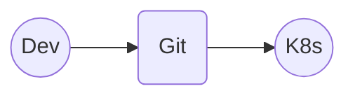
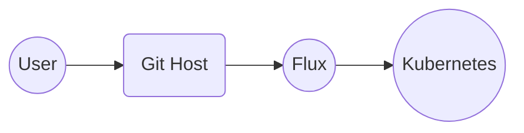
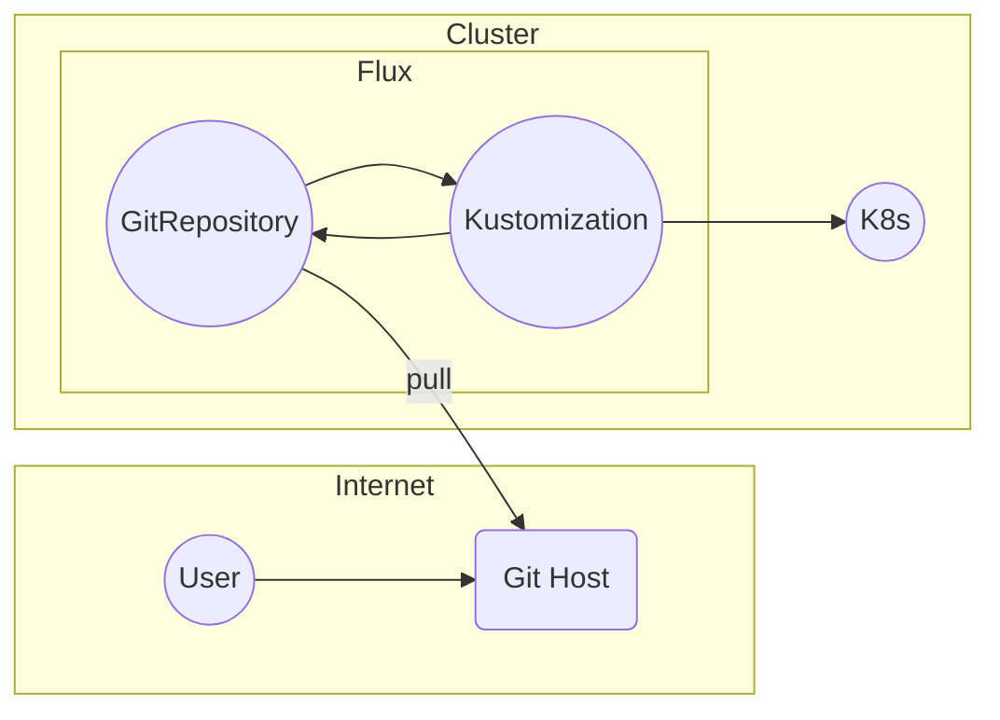
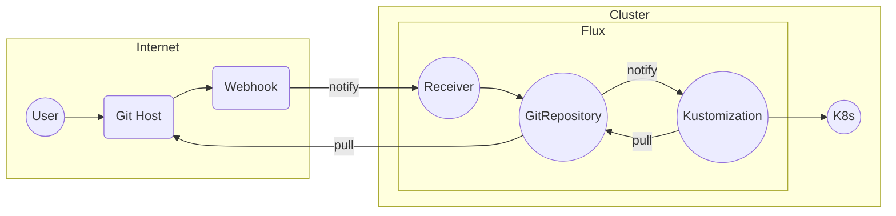
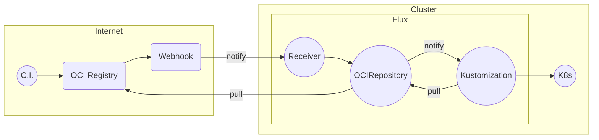
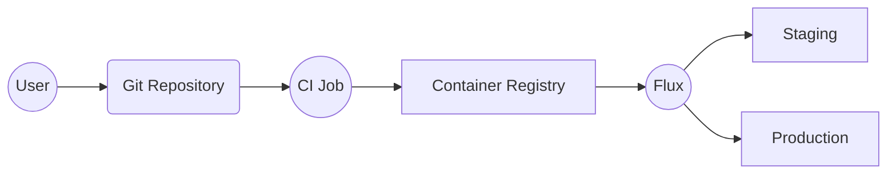

# YouChoose: Flux

subtitle
:   The Gong for Flux (FluxCD.io)

author
:   Kingdon Barrett

institution
:   Weaveworks

theme
:   rabbit-theme-wwinternalstyle

date
:   2023-07-25

allotted-time
:   5m

# Flux in 5 Minutes

# GitOps

{:
  relative_height="60"
}

Detail: [opengitops.dev](https://opengitops.dev) from GitOps WG

# Flux does GitOps

{:
  relative_height="60"
}

# How Flux does GitOps

{:
  relative_height="90"
}

# What is GitOps GA?

{:
  relative_height="90"
}

# What else is new in Flux 2.0?

* SLSA Build Level 3
* {::wait/}AWS, GCP, Azure Workload Identity for OCI Repos
* {::wait/}Horizontal scaling and shards for v.large Flux

# Ecosystem

* Weave GitOps - OSS UI (+Enterprise "WGE")
* {::wait/}VSCode (I work on this!) - GitOps Tools
* {::wait/}You might already use Flux... it's in AKS/Arc, GitLab, EKS-A

# Community

* Community Support (+paid support from Weaveworks, others)
* Fantastic team of maintainers, contributors, & community
* Contributor ladder, events calendar (come work with us!)

# Adopters

* Enterprises - SAP, Volvo, RingCentral
* Partners in Industry - Building products on Flux
* Companies have trusted Flux for years

# Automations

* SemVer SourceRef ++ Scalability ++ Security
* ImageUpdateAutomation - writes back to Git
* Flagger for Progressive Delivery
* TF-controller for Terraform

# GitOps without Git

{:
  relative_height="90"
}

# OCI Capabilities and Features

# `OCIRepository`

{:
  relative_height="60"
}

# Unparalleled Helm support

* Drift correction
* Stable release is coming - Flux 2.1
* (I know we already picked ytt! but for those that didn't...)

# Call to Action

* Download VSCode "GitOps Tools for Flux" - check out Prerelease channel!

Find the extension from the VSCode marketplaces — also visit us at [fluxcd.io](https://fluxcd.io)

# Call to Action

Read the docs & vote for Flux!
