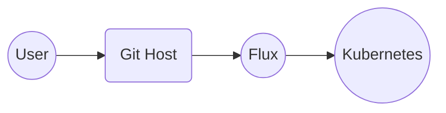
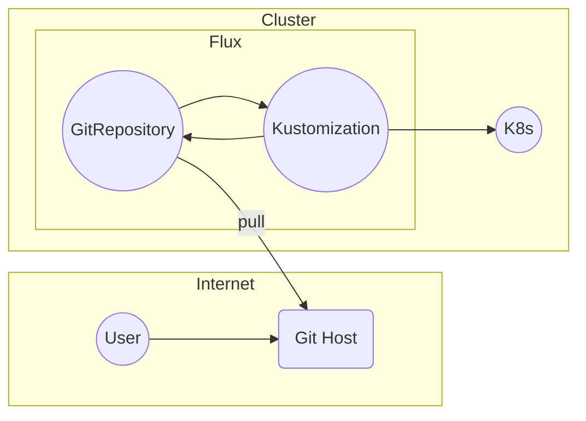
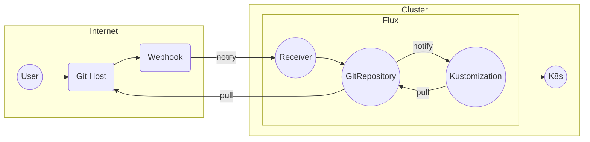

# CNCF On-Demand Webinar

subtitle
:   Basics of Flux and GitOps

author
:   Kingdon Barrett

institution
:   Weaveworks

theme
:   rabbit-theme-wwinternalstyle

date
:   2023-09-14

allotted-time
:   4m

# Flux in 2 Minutes

# GitOps

* For Beginners: (ELI5)
* {::wait/}Developer just pushes changes
* {::wait/}(**new desired state**) to Git
* {::wait/}They go automatically to **Kubernetes**

(User Experience should be simple)

# GitOps

* For Beginners: (ELI5)
* **Developer** just pushes changes
* (*new desired state*) to _Git_
* {::wait/}...notify us if everything went alright

(User Experience should be simple)

# GitOps

* Developer just pushes changes to **Git**

* {::wait/}...in case anything changes, <->
  **GitOps** reconciling (**Flux**)
  will automatically put it back
  This is called **Drift Correction**

Dist. from regular imperative CI/CD

# 4 Principles of GitOps

1. Declarative Configuration
1. {::wait/}Versioned Storage
1. {::wait/}Pulled automatically
1. {::wait/}Reconciled continuously

Detail: [opengitops.dev](https://opengitops.dev) from GitOps WG

# Diagram

{:
  relative_height="60"
}

Easy Version

# How Flux does GitOps

{:
  relative_height="110"
}

# Flux is hosted on a K8s cluster

# _ 

{:
  relative_height="110"
  relative_margin_top="-5"
  hide_title=true
}

# Subscriptions in K8s are automatic

# Subscriptions in K8s are negotiated automatically

* On the other hand, across the internet (GitHub, GitLab, Gitea, CodeCommit, ...) webhooks typically need configured

# Flux is Community

* {::wait/}Flux Developed in open under CNCF
* **Weekly Dev Meetings** - Public (Zoom)
* {::wait/}Transparent RFCs, Public Roadmap

[fluxcd.io/#calendar](https://fluxcd.io/#calendar)
