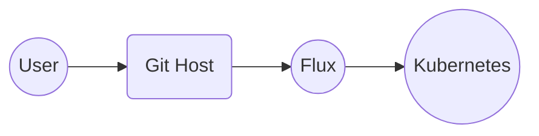
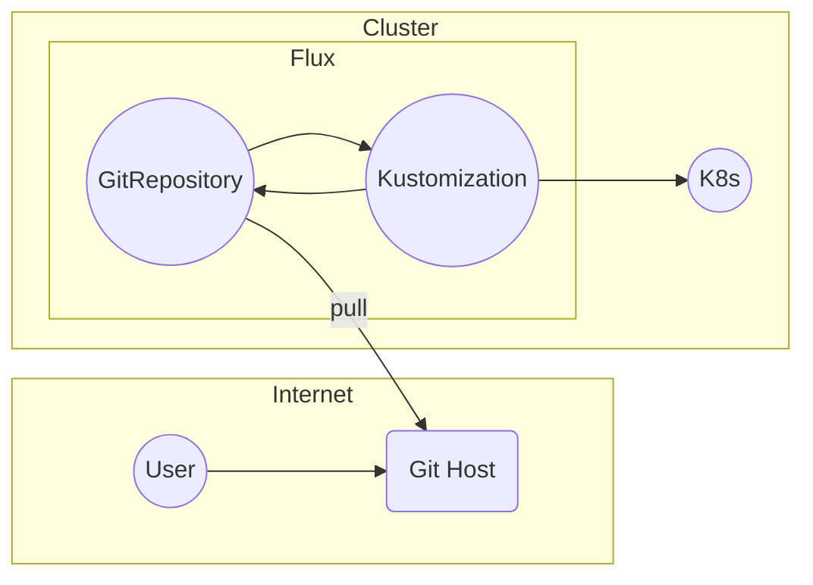
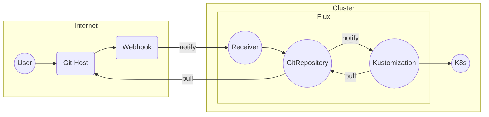

# CNCF Webinar

subtitle
:   Basics of Flux and GitOps

author
:   Kingdon Barrett

institution
:   Weaveworks

theme
:   rabbit-theme-wwinternalstyle

date
:   2023-09-14

allotted-time
:   2m

# Flux in 2 Minutes

# GitOps

* Developer just pushes changes to Git
* {::wait/}They go automatically to Kubernetes
* {::wait/}...notify us if everything was alright
* {::wait/}...in case anything changes, GitOps will put it back

(User Experience should be simple)

# 4 Principles of GitOps

1. Declarative Configuration
1. {::wait/}Versioned Storage
1. {::wait/}Pulled into the cluster
1. {::wait/}Reconciled continuously

Detail: [opengitops.dev](https://opengitops.dev) from GitOps WG

# Diagram

{:
  relative_height="60"
}

From user perspective

# How Flux does GitOps

{:
  relative_height="90"
}

Flux is in Kubernetes

# What is Flux GitOps GA?

{:
  relative_height="90"
}

Stability

# Those are the basics of Flux

* New to Flux?
* {::wait/}https://fluxcd.io/ - Read Docs
* {::wait/}https://docs.gitops.weave.works/ - Weave GitOps Web UI
* {::wait/}https://github.com/weaveworks/vscode-gitops-tools - VSCode UI

# Join Us

* {::wait/}Developed in open under CNCF
* {::wait/}Flux's RFC process, Roadmap
