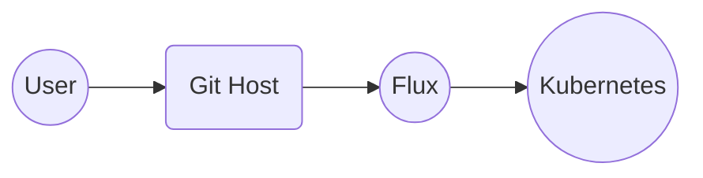
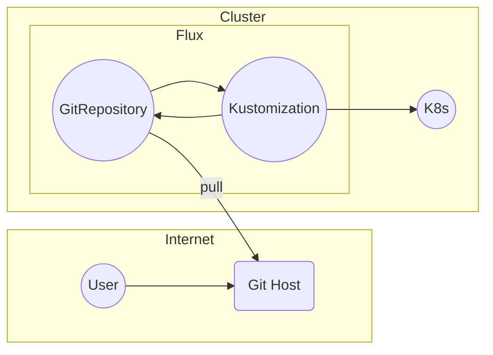
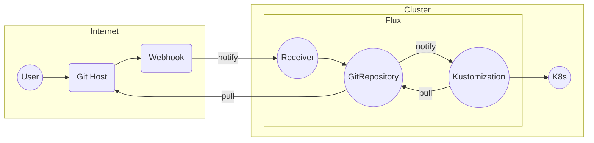

# CNCF On-Demand Webinar

subtitle
:   Basics of Flux and GitOps

author
:   Kingdon Barrett

institution
:   Weaveworks

theme
:   rabbit-theme-wwinternalstyle

date
:   2023-09-14

allotted-time
:   2m

# Flux in 2 Minutes

# GitOps

* Developer just pushes changes to Git
* {::wait/}They go automatically to Kubernetes
* {::wait/}...notify us if everything went alright

(User Experience should be simple)

# GitOps

* Developer just pushes changes to Git
* {::wait/}...in case anything changes, GitOps reconciling (Flux) will put it back
  This is called Drift Correction

(User Experience should be simple)

# 4 Principles of GitOps

1. Declarative Configuration
1. {::wait/}Versioned Storage
1. {::wait/}Pulled into the cluster
1. {::wait/}Reconciled continuously

Detail: [opengitops.dev](https://opengitops.dev) from GitOps WG

# Diagram

{:
  relative_height="60"
}

Easy experience from user perspective

# How Flux does GitOps

{:
  relative_height="90"
}

Flux is hosted on a Kubernetes cluster

# What is Flux GitOps GA?

{:
  relative_height="90"
}

{::wait/}Represents stability for infra builders

# Flux is in Active Development

* GitOps GA Represents stability for infra builders
* All parts of Flux may change, but GA API parts always remain backward compatible (forever, guaranteed)

# If you're New to Flux

* Good entry-points for Flux beginners:
* [fluxcd.io](https://fluxcd.io/) - Docs, Get Started Guide
* {::wait/}[docs.gitops.weave.works](https://docs.gitops.weave.works/) - Web UI
* {::wait/}`github/weaveworks/`[vscode-gitops-tools](https://github.com/weaveworks/vscode-gitops-tools) - Responsive VSCode Editor-UI

# Join Us

* {::wait/}Flux is Developed in open under CNCF
* {::wait/}Transparent RFCs, Public Roadmap
* Weekly Dev Meetings - Public (Zoom)
* Bug Scrub - TZ-IAmA Flux Maintainer
