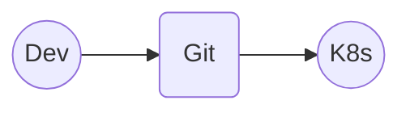
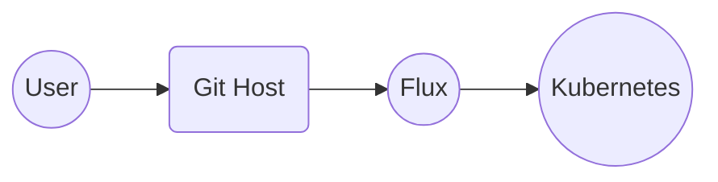

# CNCF On-Demand Webinar

subtitle
:   What is Bootstrapping?

author
:   Kingdon Barrett

institution
:   Weaveworks

theme
:   rabbit-theme-wwinternalstyle

date
:   2023-09-14

allotted-time
:   2m

# Flux Manages Itself

# GitOps

If this is GitOps...


{:
  relative_height="60"
}

Detail: [opengitops.dev](https://opengitops.dev) from GitOps WG

# Flux does GitOps

And Flux does GitOps...


{:
  relative_height="60"
}

# How does Flux get on the cluster?

Typically...

* ???
* {::wait/}It goes into Git
* {::wait/}(There are other ways as we will see)

# Bootstrap

# Bootstrap Decomposed

* `clusters/my-cluster/`
  * `flux-system/`
    * `gotk-components` - Flux itself (controllers)
    * `gotk-sync` - Business end of Flux (config)

K8s CRs `GitRepo` and `Kustomization`
represent a running Flux installation

# GitRepository API v1

```yaml
---
apiVersion: source.toolkit.fluxcd.io/v1
kind: GitRepository
metadata:
  name: flux-system
  namespace: flux-system
spec:
  interval: 1m0s
  ref:
    branch: main
  secretRef:
    name: flux-system
  url: ssh://git@github.com/kingdon-ci/fleet-infra
```

# GitRepository

* Reconcile interval - download latest
* Single ref spec - (branch main here)
* {::wait/}Can have other configuration for auth, signature verification, etc.
* {::wait/}See the API docs and getting started guide for more details

# Kustomization API v1

```yaml
---
apiVersion: kustomize.toolkit.fluxcd.io/v1
kind: Kustomization
metadata:
  name: flux-system
  namespace: flux-system
spec:
  interval: 10m0s
  timeout: 1m0s
  retryInterval: 1m30s
  path: ./clusters/test/limnocentral
  prune: true
  sourceRef:
    kind: GitRepository
    name: flux-system
```

# Flux Kustomization

* Do not confuse with Kustomize Overlay

```yaml
apiVersion: kustomize.config.k8s.io/v1beta1
kind: Kustomization
resources:
- gotk-components.yaml
- gotk-sync.yaml
```

# Flux Kustomization

* Reconcile interval - dry run, apply
* Single ref spec - Flux Source (`GitRepo`)
* {::wait/}(Optionally) wait for healthy, error unless resources go "KStatus Ready"
* {::wait/}Configurable timeout, retry interval when health check fails

# Flux Kustomization

* Configuration failures are observable through CR API's (via CRD Status),
* {::wait/}Configurable Notifications (Alerts) and Providers (Slack, Teams, PagerDuty, many others)
* {::wait/}and native Kubernetes Events

# Bootstrap Components

* `gotk-sync` - what we just saw
* `gotk-components` - Flux itself
(Impl. via K8s "Controller Runtime")

# Other Storage Backends

* GitOps does not require Git
* {::wait/}It can be any versioned store
* {::wait/}Spec.ref can point to a branch ref, or...
* {::wait/}Release-grade software typically uses SemVer tags everywhere in prod envs

# Flux Also Supports (Storage)

* `Bucket` - cloud provider s3-compatible
* {::wait/}`HelmRepository`
* {::wait/}`HelmRepository`: with `type: oci`
* {::wait/}`OCIRepository`
