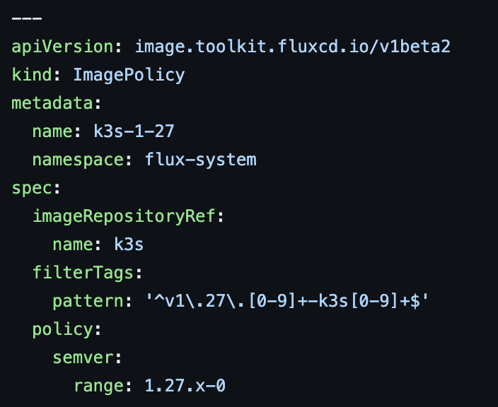
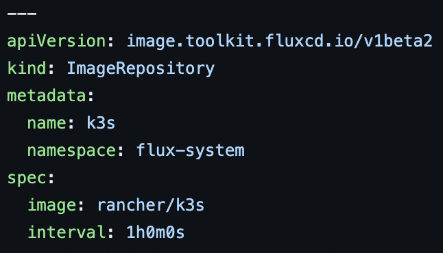

# CNCF On-Demand Webinar

subtitle
:   Image Update Automation

author
:   Kingdon Barrett

institution
:   Weaveworks

theme
:   rabbit-theme-wwinternalstyle

date
:   2023-09-14

allotted-time
:   2m

# Flux Keeps You Up To Date

# Problem: Git as Single Source of Truth

# YAML becomes stale

```yaml
spec:
  template:
    spec:
      containers:
      - name: sintache
        image: img.hephy.pro/examples/sinatra-mustache:b22.20220712.042140
```

When you write this in your YAML, how does it get updated?

# Flux Image Markers

```yaml
# {"$imagepolicy": "sintache:example"}
```

# Flux Image Policy


{:
  relative_height="60"
}

# Flux Image Repository


{:
  relative_height="60"
}

# Git Updater


{:
  relative_height="90"
}

# Problem

* While this could find a place in production...
* {::wait/}Dev's shouldn't be constantly rebasing our work on automation
* {::wait/}Git write access is extremely sensitive authorization
* {::wait/}Git history is precious
* {::wait/}Developers sensitive to noise

# Solution

* Use Semantic Versioning for releases
* The version tag is better than a mutable Git ref
* {::wait/}Tags can be verified in CI before signing
* {::wait/}CI checks can fail/block a release (policy controls!)
* {::wait/}Can work almost identically with Image Automation, or...

# Semver Spec Automation

* Works with `GitRepository`
* {::wait/}`OCIRepository`
* {::wait/}`HelmRepository`
* Release-quality software should use SemVer
* No automation requirement for Git write access to use
