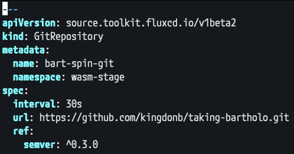
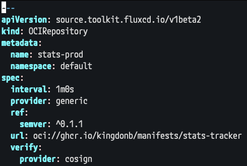
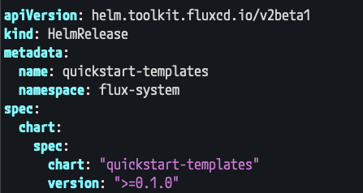
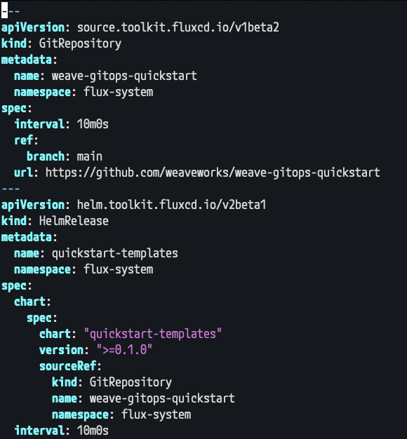

# CNCF On-Demand Webinar

subtitle
:   SemVer Spec Automation

author
:   Kingdon Barrett

institution
:   Weaveworks

theme
:   rabbit-theme-wwinternalstyle

date
:   2023-09-14

allotted-time
:   2m

# Flux Keeps You Up To Date

# Flux encourages Semantic versioning

# Semver Spec Automation

* Works with `GitRepository`
* {::wait/}`OCIRepository`
* {::wait/}`HelmRepository`
* Release software uses SemVer
* No automation requirement for Git write access to use - enhanced safety

# `GitRepository`

{:
  relative_height="90"
}

# `OCIRepository`

{:
  relative_height="90"
}

# `HelmRelease`

{:
  relative_height="100"
}

# `HelmRelease`

{:
  relative_height="130"
}

# Drawbacks

* No commit to revert (rely on Notifications instead)
* Trusting authors to provide reliable artifacts

# Benefits

* No commits to rebase
* {::wait/}Rely on Notifications!
* {::wait/}Trusting authors to provide reliable artifacts!
* {::wait/}Expectation of quality ++

# Start Using Flux Today

* Download VSCode "GitOps Tools for Flux" - check out Prerelease channel!

Find the extension from the VSCode marketplaces — also visit us at [fluxcd.io](https://fluxcd.io)
