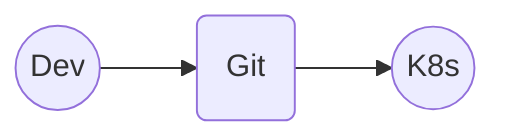
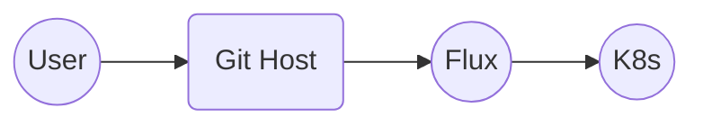
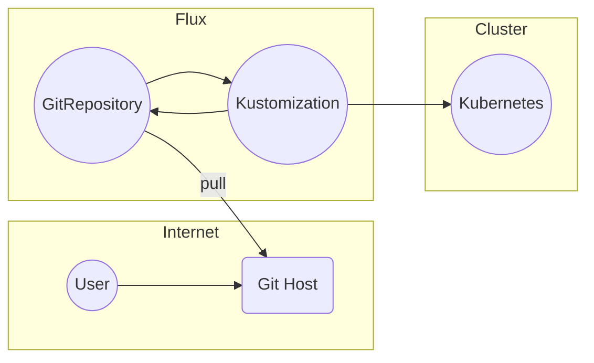
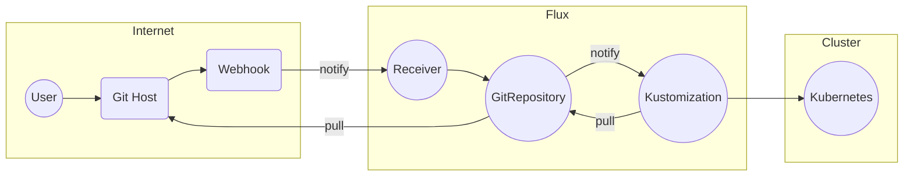
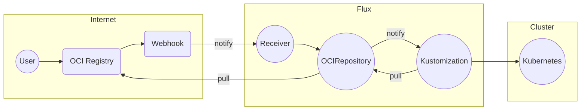
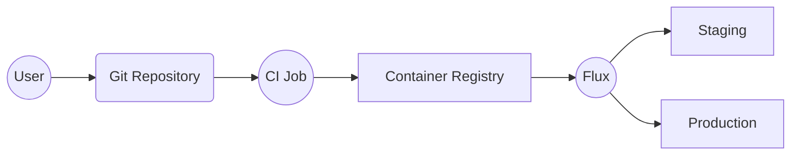

# YouChoose Flux Pitch Deck

subtitle
:   What's Great About Flux

author
:   Kingdon Barrett

institution
:   Weaveworks

theme
:   rabbit-theme-wwinternalstyle

date
:   2023-07-25

allotted-time
:   5m

start-time
:   2023-07-25T14:00:00-04:00

end-time
:   2023-07-25T15:30:00-04:00

# Flux in 5 Minutes

# GitOps

{:
  relative_height="60"
}

Detail: [opengitops.dev](https://opengitops.dev) from GitOps WG

# Flux does GitOps

{:
  relative_height="60"
}

# How Flux does GitOps

{:
  relative_height="90"
}

# What is GitOps GA?

{:
  relative_height="90"
}

# GitOps without Git

{:
  relative_height="90"
}

# What else is new in Flux 2.0?

# Automation

# How is OCI used?

# `OCIRepository`

{:
  relative_height="40"
}

# Unparalleled Helm support

# Ecosystem

# Partners in Industry

# Adopters

# Community
