# YouChoose Flux Pitch Deck

subtitle
:   What's Great About Flux

author
:   Kingdon Barrett

institution
:   Weaveworks

theme
:   rabbit-theme-wwinternalstyle

date
:   2023-07-25

allotted-time
:   5m

start-time
:   2023-07-25T14:00:00-04:00

end-time
:   2023-07-25T15:30:00-04:00

# Flux in 5 Minutes

# GitOps

# Flux does GitOps

ICYMI

(Diagram showing basic idea of GitOps)

# How

# How Flux does GitOps

(Context Diagram showing User, GitHub, GitRepository, Kustomization, Receiver, and Subscriptions between all of these)

You get independent configuration, control, and observability of those resources via metrics

# GitOps GA

# What is GitOps GA?

GitRepository, Kustomization, v1 APIs

Notifications APIs (`Alert`, `Provider`, `Event`)

# Flux 2.0

# What else is new in Flux 2.0?

* SLSA Build Level 3
* Workload Identity with OCI
* Sharding & horizontal scaling

# Automation

* Flux Image Automation
  * Sequentially numbered images
* Flux OCIRepository Artifact
  * `flux push artifact` - whole manifest
* SemVer Sources Automation
  * for tagged workloads

# Native Helm

# Unparalleled Helm support

* Helm SDK under the hood
* Post-render Kustomizations make modding Helm charts easy
* Drift Correction feature now (behind Feature Gate)
* `HelmRepository` with oci

# Ecosystem

* You might already be using Flux and not even know it
* Flux is under the hood:
  * GitLab Agent, EKS Anywhere, Azure Arc

# Partners in Industry

* Ecosystem of infrastructure vendors supporting Flux
* `microsoft.flux` Extension, AWS (EKSctl), GitLab, and more
* ... all embed Flux in their Kubernetes + CD platforms

# Adopters

* Enterprises have been trusting Flux for a long time
* SAP, RingCentral, Volvo
* Telecoms, Banks/Financial Institutions, Universities
* Many institutions have trusted Flux for years

# Ecosystem and Community

* Weave GitOps OSS
* VSCode GitOps Tools Extension (by Weaveworks)
* Many Third-party UIs

# Ecosystem and Community

* Shout out to Paid support available
* Weave GitOps Enterprise

# Context Diagram

```mermaid
C4Context
      title Flux in a Nutshell
      Enterprise_Boundary(w0, "The Internet") {
        System(SystemGH, "GitHub", "Hosts Git source repositories")
        Person(developerA, "Developer A", "A customer of the bank, with personal bank accounts.")
        Person(developerB, "Developer B")
        Person_Ext(customerC, "Banking Customer C", "desc")

        Person(customerD, "Banking Customer D", "A customer of the bank, <br/> with personal bank accounts.")

        %% System(SystemAA, "Internet Banking System", "Allows customers to view information about their bank accounts, and make payments.")
        %% Enterprise_Boundary(b1, "BankBoundary") {
        %%   SystemDb_Ext(SystemE, "Mainframe Banking System", "Stores all of the core banking information about customers, accounts, transactions, etc.")
        %%   System_Boundary(b2, "BankBoundary2") {
        %%     System(SystemA, "Banking System A")
        %%     System(SystemB, "Banking System B", "A system of the bank, with personal bank accounts. next line.")
        %%   }
        %%   System_Ext(SystemC, "E-mail system", "The internal Microsoft Exchange e-mail system.")
        %%   SystemDb(SystemD, "Banking System D Database", "A system of the bank, with personal bank accounts.")
        %%   Boundary(b3, "BankBoundary3", "boundary") {
        %%     SystemQueue(SystemF, "Banking System F Queue", "A system of the bank.")
        %%     SystemQueue_Ext(SystemG, "Banking System G Queue", "A system of the bank, with personal bank accounts.")
        %%   }
        %% }
      %% }

      %% BiRel(customerA, SystemAA, "Uses")
      %% BiRel(SystemAA, SystemE, "Uses")
      %% Rel(SystemAA, SystemC, "Sends e-mails", "SMTP")
      %% Rel(SystemC, customerA, "Sends e-mails to")

      %% UpdateElementStyle(customerA, $fontColor="red", $bgColor="grey", $borderColor="red")
      %% UpdateRelStyle(customerA, SystemAA, $textColor="blue", $lineColor="blue", $offsetX="5")
      %% UpdateRelStyle(SystemAA, SystemE, $textColor="blue", $lineColor="blue", $offsetY="-10")
      %% UpdateRelStyle(SystemAA, SystemC, $textColor="blue", $lineColor="blue", $offsetY="-40", $offsetX="-50")
      %% UpdateRelStyle(SystemC, customerA, $textColor="red", $lineColor="red", $offsetX="-50", $offsetY="20")

      %% UpdateLayoutConfig($c4ShapeInRow="3", $c4BoundaryInRow="1")
```
{:
  relative_height="90"
}

# Mindmap


{:
  relative_height="90"
}

# Mindmap 2

```mermaid
mindmap
    id1["`**Root** with
a second line
Unicode works too: 🤓 ✅`"]
      id2["`The dog in **the** hog... a *very long text* that wraps to a new line 🤓 ✅`"]
      id3[Regular labels still works]
```


{:
  relative_height="90"
}

# 1. Flux does GitOps


{:
  relative_height="90"
}

# 2. Flux Graduated CNCF

* GitRepository, Kustomization, and Receiver `v1` ✅
* Micro-service oriented CRDs

# 3. GitOps GA

* GitRepository, Kustomization, and Receiver `v1` ✅
* Micro-service oriented CRDs

# 4. Flux GA is loaded with news

SLSA Build Level 3 - compliance and provenance verification, protection against tampering
GitOps GA Milestone - stable (v1) APIs for Flux’s core GitOps features and notifications API brings added clarity for platform teams, infra vendors about stability & guarantees.
Workload Identity - integrated with Flux’s OCIRepository sources - security, ease of use wrt handling secrets (use passwordless/ambient environment credentials)
v2.0 Flux introduces the horizontal sharding & scaling capability for maintaining service level on v. XL Flux installations
Performance improvements including especially Helm, and Helm-upgrade drift detection

